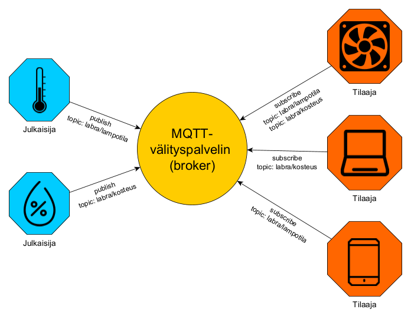

# Johdanto

## Mikä on MQTT?

MQTT (MQ Telemetry Transport) on kevyt ja avoin viestinvälitysprotokolla, joka on suunniteltu erityisesti laitteiden väliseen kommunikaatioon ympäristöissä, joissa verkon kaistanleveys ja resurssit ovat rajalliset. MQTT on hyvin suosittu esineiden internet (Internet of Things, IoT) -sovelluksissa, kuten antureiden ja muiden pienen virrankulutuksen laitteiden välisessä viestinnässä. Nimessä oleva sana 'telemetria' tarkoittaakin etämittausta. Protokolla on alun perin kehitetty vuonna 1999 IBM:n ja Arcomin (nykyään Eurotech) yhteistyönä, ja nykyisin sen ylläpidosta vastaa OASIS-niminen avointen standardien organisaatio. Toisinaan nimen ensimmäinen kirjainpari MQ puretaan vielä sanoiksi Message Queue, millä on historiallista pohjaa, mutta nykyisin tekniikalla ei ole mitään tekemistä viestijonojen kanssa, joten se on harhaanjohtavaa.

MQTT käyttää julkaisija&ndash;tilaaja-mallia (Publish&ndash;Subscribe), jossa laitteet voivat joko julkaista (publish) viestejä tiettyyn aiheeseen (topic) tai tilata (subscribe) viestejä tietystä aiheesta. Viestit välittää välityspalvelin (broker) Tämä mahdollistaa irtikytketyn viestinnän, jossa lähettäjän ja vastaanottajan ei tarvitse olla yhteydessä toisiinsa suoraan. Alla oleva kuva havainnollistaa tätä.

 \
*MQTT:n viestinvälityksen periaate. Lämpö- ja kosteusanturi julkaisevat viestejä eri aiheella, ja tilaajalaitteet tilaavat niistä jompaakumpaa tai kumpaakin.*

Irtikytkennällä on kolme tasoa, jotka kaikki tuovat etua viestintään
1. __Paikka:__ Tilaajan ja julkaisijan ei tarvitse tuntea toisiaan, esim. toistensa IP-osoitetta ja porttia kuten asiakas&ndash;palvelin-mallissa. Niiden ei tarvitse edes tietää toistensa olemassa olosta.
2. __Aika:__ Tilaajan ja julkaisijan ei tarvitse toimia samanaikaisesti.
3. __Tahdistus:__ Julkaiseminen tai tilaaminen ei keskeytä laitteiden muita toimintoja.

Irtikytkentä tuo toisaalta kaksi haastetta
1. Julkaisijan ja tilaajan täytyy tietää, mitä aihetta käyttää. 
2. Julkaisija ei voi tietää, vastaanottaako joku sen julkaisuja.

MQTT:n toimintaa voi verrata radioon: lähetys etenee, vaikka kukaan ei kuuntelisi kanavaa. Viestijonossa puolestaan viesti odottaa jonossa kunnes joku vastaanottaa sen. Lisäksi viestijonon viesteillä voi olla vain yksi vastaanottaja. Kuten radiokanavaa, MQTT-välityspalvelimen kautta julkaistuja aiheita voi kuunnella eli vastaanottaa suuri lukumäärä tilaajia. MQTT-protokolla ei itsessään rajoita tilaajien määrää, vaan rajoitukset tulevat välityspalvelimista. Viestin koko vaikuttaa enimmäismäärään, mutta yleensä puhutaan ainakin tuhannesta yhdenaikaisesta asiakkaasta per aihe. Ilmaisia välityspalvelimia ovat esimerkiksi [Eclipse Mosquitto](https://mosquitto.org/) ja [HiveMQ](https://www.hivemq.com/).  

MQTT on suunniteltu mahdollisimman kevyeksi ja tehokkaaksi, mikä tekee siitä sopivan laitteisiin, joissa on rajalliset resurssit kuten prosessointiteho, muisti ja kaistanleveys. Lisäksi se on suunniteltu toimimaan epäluotettavissa verkoissa, joissa yhteydet voivat olla epävakaita tai hitaasti toimivia. MQTT:n viestien otsikot ovat erittäin pieniä, mikä vähentää kaistanleveyden käyttöä ja tekee siitä tehokkaan protokollan. MQTT-protokollaa tukevia kirjastoja on saatavilla monille eri ohjelmointikielille ja alustoille, mikä helpottaa sen käyttöönottoa ja integrointia erilaisiin sovelluksiin.

MQTT:stä on kolme versiota: 3.1, 3.1.1 ja 5.0. Versio 3.1.1 paransi virheenkäsittelyä ja yhteensopivuutta, ja versio 5.0 toi niihin lisää parannuksia sekä turvallisuuteen ja toi mukanaan lisäksi liudan uusia ominaisuuksia kuten mekanismin viestien metadataan.

## Paho MQTT

Tässä oppimismateriaalissa hyödynnetän Python-ohjelmointikieltä ja sen [Paho-MQTT](https://pypi.org/project/paho-mqtt/)-moduulia. Paho-MQTT asennetaan Pip-paketinhallintajärjestelmän kautta komennolla
    
    pip install paho-mqtt

Esimerkkiohjelmia laatiessa on käytetty silloista moduulin uusinta versiota 2.1.0. Ohjelmien toimivuuden voi varmistaa asentamalla samaisen version komennolla

    pip install paho-mqtt==2.1.0

## Kurssin rakenne

Kurssi koostuu tämän johdanto-osion lisäksi kahdesta osiosta, jotka ovat omina md-tiedostoinaan. Toinen osa Toiminta ([02-toiminta.md](02-toiminta.md)) käsittelee MQTT:n viestinvälityksen rakennetta asiakkaan ja välityspalvelimen välillä, esittelee Paho MQTT:n `client`-luokan ja sen käytön julkaisemiseen ja tilaamiseen sekä tarjoaa esimerkkiohjelmat julkaisijasta ja tilaajasta. Kolmas osa Lisätietoa ([03-lisatietoa.md](03-lisatietoa.md)) kertoo tarkemmin viestin mittadatan purkamisesta, yksittäisten viestien julkaisemisesta ja tilaamisesta sekä viestiliikenteen salaamisesta. Molempien osioiden lopuksi on muutama tehtävä, joilla oppimaansa voi kokeilla. Osioiden esimerkkiohjelmat ovat kansiossa esimerkkiohjelmat Python-tiedostoina.

Oppimismateriaalin pääasiallisena lähteenä on käytetty HiveMQ:n [e-kirjaa MQTT:n perusteista](https://www.hivemq.com/static/ebooks/hivemq-ebook-mqtt-essentials.pdf) sekä aiemmassa kappaleessa jo kertaalleen linkattua [Paho-MQTT moduulin GitHub-sivua](https://pypi.org/project/paho-mqtt/) ja [moduulin erillistä dokumentaatiosivua](https://eclipse.dev/paho/files/paho.mqtt.python/html/). Kirjan lukemista sekä dokumentaation kahlaamista suositellaan niille, jotka haluavat tietää aiheesta enemmän.

## Kurssin rakenne

### Johdanto | [Toiminta](02-toiminta.md) | [Lisätietoa](03-lisatietoa.md)
