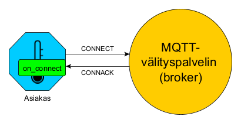
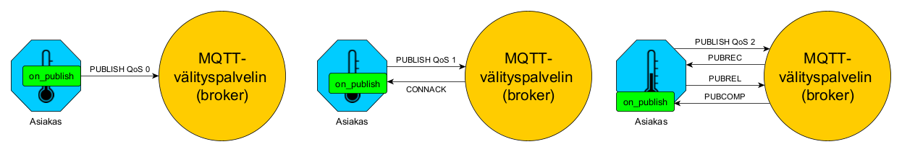
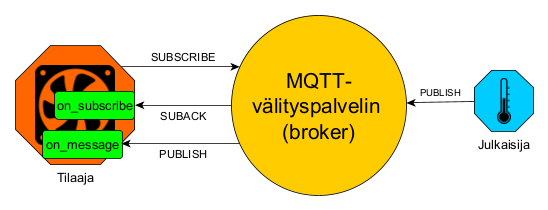
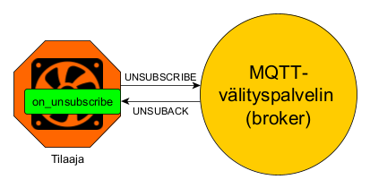
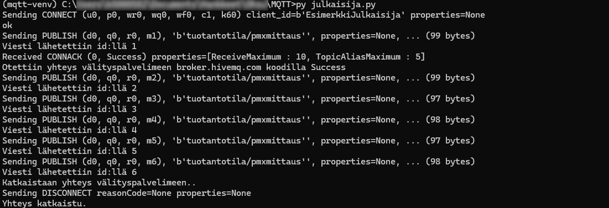

# Toiminta
Välityspalvelin on vastuussa kaikkien viestien vastaanottamisesta ja suodattamisesta sekä viestien välittämisestä niiden tilaajille. MQTT-asiakas taas voi olla joko julkaisija tai tilaaja, joskus jopa molempia. Asiakas voi olla tietokone, puhelin, Rapspberry Pi, Arduino tms. Koska MQTT-protokolla pohjaa TCP/IP:hen, asiakkaan täytyy käyttää TCP/IP-pinoa. Asiakkaan ja välityspalvelimen kommunikaatio perustuu asiakkaan palvelimelle lähettämiin viesteihin ja vastauksena saatuihin kuittausviesteihin (acknowledgement, ACK). Seuraavat kappaaleet kertovat olennaiset tästä viestinvälityksestä, kun käytetään Paho-MQTT:tä.

## Asiakkaan luominen

Kun Paho-MQTT on importattu komennolla `import paho.mqtt.client as mqtt`, asiakas luodaan komennolla

    client = mqtt.Client(mqtt.CallbackAPIVersion.VERSION2, asiakkaan_nimi)

Varsinaisia pakollisia parametreja ei ole kuin `callback_api_version`. Yleensä tosin myös asiakkaan nimi tahdotaan antaa. Tässä selitys kaikista parametreista, mitä voidaan käyttää:
- `callback_api_version` kertoo callback-funktioiden (näistä seuraavassa kappaleessa lisää) API:n versionumeron ja vaihtoehtoina on `...VERSION1` ja `...VERSION2`. Kakkosversion käyttöä suositellaan, ja se on yhteensopiva MQTT:n kaikkien versioiden kanssa. Ykkösversio on lähinnä Paho-MQTT:n historiallista painolastia, ja se tullaan poistamaan käytöstä tulevasuudessa. 
- `client_id` on asiakkaan nimi, ja __sen täytyy olla yksilöllinen__. Samanniminen asiakas pudottaa aiemman pois palvelimelta. Tämän voi jättää myös tyhjäksi, jolloin välityspalvelin luo yksilöllisen nimen automaattisesti. Käytettäessä MQTT 3.1:tä ta 3.1.1:tä seuraavaksi kerrotun parametrin `clean_session` arvo täytyy tällöin olla `True`.
-  `clean_session`: Jos tämän arvo on `True`, kaikki tieto asiakkaasta poistetaan palvelimelta asiakkaan katkaistessa yhteyden. Jos arvo on `False`, tieto asiakkaan tilauksesta säilyy palvelimella yhteyden katkaisemisen jälkeekin. Tämä pätee vain MQTT:n versioihin 3.1 ja 3.1.1. Versiota 5.0 käytettäessä tämä määritellään vasta asiakkaan ottaessa yhteyttä välityspalvelimelle.
- `userdata` on käyttäjän määrittelemä vapaatyyppinen tieto, joka välitetään callback-funktioille
- `protocol` on käytettävä protokolla eli MQTT:n versio. Vaihtoehdot ovat `paho.mqtt.client.MQTTv31` (3.1), `paho.mqtt.client.MQTTv311` (3.1.1) ja  `paho.mqtt.client.MQTTv5` (5.0). Oletus on 3.1.1.
- `transport` on välitysmekanismi, ja vaihtoehdot ovat `tcp` (oletus), `websockets` ja `unix`. Websocketit sopivat erityisesti selainpohjaisiin sovelluksiin, palomuurien ja NAT-reitittimien läpi kulkevaan liikenteeseen ja web-teknologioiden integrointiin. Unix-socketit sopivat sovelluksiin, joissa suorituskyky, alhainen viive ja turvallisuus ovat kriittisiä ja joissa viestintä tapahtuu samalla fyysisellä laitteella olevan välityspalvelimen kautta.
- `manual_ack` mahdollistaa viestien manuaalisen kuittauksen ollessaan `True`. Normaalisti kirjasto kuittaa viestit automaattisesti heti vastaanoton jälkeen. Manuaalinen kuittaus on hyödyllistä, kun halutaan varmistaa, että viestit käsitellään oikein ennen vastaanoton ilmoittamista välityspalvelimelle. Tämä liittyy julkaisemisen laatutasoihin 1 ja 2, joista enemmän julkaisun yhteydessä.

### Callback-funktiot

Paho-MQTT:n käyttöliittymä sisältää erilaisia callback-funktioita, jotka tietyt tapahtumat liipaisevat. Tämä voi tarkoittaa yksinkertaisesti vastaanotetun viestin tulostamista tai paljon monimutkaisempaa toimintaa. Callback-funktiot luodaan ensin omana funktionaan (`def`) ja sitten sidotaan luotuun asiakasolioon. Käydään seuraavaksi läpi viisi usein käytettyä callback-funktiota: `on_connect`, `on_subscribe`, `on_message`, `on_publish` ja `on_log`. Myöhemmin näytettävissä esimerkkitilaajan ja esimerkkijulkaijan koodissa nämä funktiot ovat omilla paikoillaan. Kaikissa funktioissa parametrit `reason_code` (tai `reason_code_list`) ja `properties` liittyvät MQTT 5.0:aan.

#### on_connect
Tämä callback-funktio suoritetaan, kun välityspalvelimelta saadaan vastaus yhteydenottoon. Se voi olla esim. seuraavanlainen:

    def on_connect(client, userdata, flags, reason_code, properties):
        print(f"Otettiin yhteys ja saatiin vastaus {reason_code}.")

Parametrit
- `client` on  viittaus asiakkaaseen, joka funktiota kutsuu
- `userdata` on käyttäjän asiakkaan luonnissa määrittelemä tieto
- `flags`  Paho-MQTT:n ConnectFlags-olio, joka sisältää erityistä tietoa yhteyden tilasta
- `reason_code` Paho-MQTT:n ReasonCodes-olio joka tarjoaa tarkemman tiedon yhteyden onnistumisesta tai epäonnistumisesta
- `properties` on sanakirja, joka sisältää metatietoja yhteydestä avain-arvopareina

Funktio sidotaan client-nimiseen asiakkaaseen näin:

    client.on_connect = on_connect

#### on_subscribe
Palvelimelta saatu vastaus aiheen tilaukseen liipaisee tämän callback-funktion. Funktio voi esim. tulostaa palvelimelta saadun kuittauksen.

    def on_subscribe(client, userdata, message_id, rc_list, properties):
        print(f"Tilausviestin tunniste {message_id}, saatu kuittaus {rc_list}.")

Parametrit
- `message_id` on alkuperäisen tilausviestin tunniste
- `reason_code_list` on lista, joka sisältää välityspalvelimelta tulleen syykoodin jokaiselle tilatulle aiheelle. Syykoodit kertovat, kuinka välityspalvelin on käsitellyt tilaukset.
- `properties` sisältää tilaukseen liittyvän metatietoja, ja se voi sisältää esimerkiksi tilauksen aikakatkaisuajan, käyttäjän määrittämiä ominaisuuksia 

Sitominen asiakkaaseen tapahtuu kuten edellä:

    client.on_subscribe = on_subscribe

#### on_message
Kun tilaaja vastaanottaa tilaamansa viestin palvelimelta, suoritetaan tämä funktio. Yksinkertaisimmillaan se voi vain tulostaa saadun viestin tietoineen kuten tässä, tai siihen voidaan asettaa jotain toimintaa, joka suoritetaan tietyllä viestin arvolla, esim. lämpötilan ollessa yli tietyn raja-arvon. Tuttujen parametrien `client` ja `userdata` lisäksi tällä funktiolla on parametrina vain `message` eli vastaanotettu viesti. Tällä MQTTMessage-oliolla on ominaisuuksina viestin aihe, itse viesti (payload), viestin laatutaso (tästä lisää julkaisemisen yhteydessä), säilytyslippu eli onko viesti tuore vai säilytetty ja id.  

    def on_message(client, userdata, message):
    print(f"viesti vastaanotettu: {msg.payload.decode('utf-8')}")
    print(f"viestin aihe: {msg.topic}")
    print(f"viestin laatutaso: {msg.qos}")
    print(f"viestin säilytyslippu: {msg.retain}")
    print(f"viestin id: {msg.mid}")

Sitominen asiakkaaseen tapahtuu tuttuun tapaan

    client.on_message = on_message

#### on_publish

Kun julkaisija julkaisee viestin, tämä callback-funktio suoritetaan. Funktiota voidaan käyttää vaikkapa viestin id:n tulostamiseen, kuten seuraavassa esimerkissä: 

    def on_publish(client, userdata, message_id, reason_code, properties):
        print(f"Viesti lähetettiin id:llä {message_id}")

        client.on_publish = on_publish
#### on_log

MQTT-asiakas kirjaa lokia tapahtumista. Lokin kirjoittaminen liipaisee callback-funktion `on_log`, ja sitä voidaan käyttää lokikirjausten tulostamiseen ruudulla seuraavalla tavalla:

    def on_log(client, userdata, level, msg):
        print(msg)

    client.on_log = on_log

Parametri `level` on lokitaso eli yksi seuraavista: `MQTT_LOG_ERR`, `MQTT_LOG_WARNING` `MQTT_LOG_NOTICE`, `MQTT_LOG_INFO` ja `MQTT_LOG_DEBUG`

## Yhteydenotto: CONNECT&ndash;CONNACK

Yhteys välityspalvelimeen otetaan asiakasolion metodilla `connect` antamalla parametriksi välityspalvelimen osoite:

    client.connect("broker.hivemq.com")

Muita parametreja ovat
- `port` on käytettävä portti. Oletus on 1883.
- `keepalive` on enimmäisajanjakso sekunteina, jonka yhteys pysyy auki vaikkei välityspalvelimelta tule liikennettä. Oletus on 60.
- `clean_start` on MQTT 5.0:ssa sama kuin MQTT 3.1.1:ssä asiakkaan luonnin yhteydessä käytetty parametri `clean_session`. Jos siis arvo on `True`, kaikki tieto asiakkaasta poistetaan palvelimelta asiakkaan katkaistessa yhteyden.
- `properties` MQTT 5.0:ssa yhteyden ottamisen yhteydessä välityspalvelimelle lähetettävä mahdollinen `properties`-paketti

Ottaessaan yhteyden palvelimeen, asiakas lähettää välityspalvelimelle CONNECT-viestin. Viestissä on mm. asiakkaan nimi sekä mahdollisesti käyttäjänimi ja salasana, jos kyse on salatusta viestiliikenteestä.

Välityspalvelin vastaa asiakkaalle CONNACK-kuittauksella. Kuittauksessa on paluukoodina, onnistuiko yhteydenotto. Vaihtoehtoja ovat seuraavat:

- Yhteyden muodostaminen onnistui
- Yhteys evätty &ndash; väärä protokollaversio
- Yhteys evätty &ndash; virheellinen asiakastunnus
- Yhteys evätty &ndash; välityspalvelin ei ole saatavilla
- Yhteys evätty &ndash; väärä käyttäjätunnus tai salasana
- Yhteys evätty &ndash; ei oikeuksia

CONNACK-viestin vastaaottaminen liipaisee asiakkaan callback-funktion `on_connect`, jos sellainen on määritelty. Edellisen osion `on_connect`-funktio siis tulostaisi ruudulle välityspalvelimelta saadun CONNACK-viestin syykoodin, joka kertoisi yhteydenoton onnistumisesta. Seuraava kuvio havainnollistaa tätä kättelyä:

 \
*Havainnollistava kuva yhteydenoton viestiliikenteestä asiakkaan ja välityspalvelimen välillä.*

## Julkaiseminen: PUBLISH&ndash;PUBACK

Julkaiseminen tehdään asiakasolion metodilla `publish`. Parametreina annetaan aihe ja julkaistava data json-muodossa. Lisäksi voidaan antaa viestin laatutaso (Quality of Service, QoS). MQTT tarjoaa kolme eri viestinvaihdon laatutasoa, joiden avulla voidaan määritellä, miten viestien toimitus varmistetaan:
- QoS 0: "At most once" &ndash; Viesti lähetetään kerran, ilman vahvistusta.
- QoS 1: "At least once" &ndash; Viesti lähetetään uudelleen, kunnes vahvistus vastaanotetaan.
- QoS 2: "Exactly once" &ndash; Viesti varmistetaan toimitetuksi vain kerran.

Oletuksena käytetään laatutasoa 0 eli toimitusta ei varmisteta mitenkään. Tämä on nopein ja tehokkain tapa viestinvälitykseen. Laatutasolla 1 julkaisija säilyttää lähettämäänsä viestiä, kunnes saa välityspalvelimelta viestin id:n sisältävän PUBACK-kuittauksen. Jos kuittaus ei saavu järjellisessä ajassa (tämä voidaan määritellä metodilla `reconnect_delay_set`, dokumentaatio [tässä](https://eclipse.dev/paho/files/paho.mqtt.python/html/client.html#paho.mqtt.client.Client.reconnect_delay_set)), julkaisija lähettää viestin välityspalvelimelle uudestaan duplikaattia tarkoittavan DUP-lipun kanssa. Laatutasolla 2 asiakas ja välityspalvelin suorittavat nelivaiheisen kättelyn. Ensin välityspalvelin kuittaa viestin vastaanotetuksi PUBREC-kuittauksella, sitten asiaks kuittaa kuittauksen vastaanotetuksi PUBREL-kuittauksella, johon välityspalvelin vielä vastaa PUBCOMP-kuittauksella. Näin sekä julkaisija että välityspalvelin voivat olla varmoja, että viesti on julkaistu. Tämä on hitain mahdollinen viestinvälitysmuoto.

On tärkeää huomata, että laatutasot 1 ja 2 varmistavat vain sen, että viesti toimitetaan aktiivisille tilaajille. Jos tilaaja aloittaa tilaamisensa myöhemmin kuin aiheen julkaiseminen on aloitettu, menettää tämä aiemmat viestit laatutasosta riippumatta.

Laatutasolla 0 julkaiseminen liipaisee callback-funktion `on_publish`. Laatutasolla 1 sen tekee PUBACK-kuittauksen vastaanotto, ja laatutasolla 2 PUBCOMP-kuittauksen vastaanotto. Seuraava kuvio havainnollistaa tätä:

 \
*Havainnollistava kuva julkaisun viestiliikenteestä asiakkaan ja välityspalvelimen välillä.*

Seuraavassa esimerkissä luodaan keinotekoinen mittauspiste, joka sisältää paineen, lämpötilan ja kosteuden arvot. Mittauspiste muutetaan json-muotoon ja julkaistaan aiheella "tuotantotila/pmxmittaus" laatutasolla 0. 

        measurement = {
            "pressure": 1024,
            "temperature": 22,
            "humidity": 33 
        }
        data = json.dumps(measurement)
        client.publish("tuotantotila/pmxmittaus", data, qos=0)

Suositeltavaa on, että aiheen tasot erotellaan kauttaviivalla. Näin eri tiloissa olevat mittaukset saadaan eroteltua tosistaan, esim.: "tuotantotila/robotin_asema", "tuotantotila/kuljettimen_nopeus", "drooni1/korkeus", "drooni1/nopeus", "drooni2/gyroskooppi".

Jos haluaa käyttää samaa julkaisijaa julkaisemaan useampaa aihetta, täytyy jokainen aihe julkaista omalla `publish`-komennollaan. Tämän voi tehdä vaikka silmukassa. Samalla `publish`-komennolla ei siis voi julkaista useampaa aihetta.

## Tilaaminen: SUBSCRIBE&ndash;SUBACK

Tilaaminen aloitetaan asiakkaan `subscribe`-metodilla. Metodille annetaan parametrina tilattu aihe ja käytettävä laatutaso. Oletuksena käytetään laatutasoa 0. Jos tilataan useampi aihe, parametrina annetaan lista, jossa ovat aiheet ja niiden laatutasot tupleina. Monimutkaisempia kutsumistapoja löytyy [metodin dokumentaatiosta](https://eclipse.dev/paho/files/paho.mqtt.python/html/client.html#paho.mqtt.client.Client.subscribe). Esimerkkikutsuja:

    client.subscribe("tuotantotila/pmxmittaus")

    client.subscribe([("tuotantotila/pmxmittaus", 0), ("tuotantotila/robotin_asema", 1)])

Useamman aiheen voi tilata myös peräkkäisillä `subscribe`-kutsuilla:

    client.subscribe("tuotantotila/pmxmittaus")
    client.subscribe("tuotantotila/robotin_asema", 1)

On kuitenkin selkeämpää tilata aiheet yhdellä `subscribe`-kutsulla, sillä tämä tekee koodista siistimmän, vähentää viestiliikennettä asiakkaan ja välityspalvelimen välillä sekä helpottaa virheenkäsittelyä yhdistämällä useiden aiheiden tilaukset samaan SUBACK-kuittaukseen. Välityspalvelin siis vastaa SUBSCRIBE-viestiin SUBACK-kuittauksella, jonka vastaanottaminen liipaisee asiakkaan `on_subscribe`-callback-funktion, jos sellainen on määritelty. Viestin vastaanotto taas liipaisee asiakkaan callback-funktion `on_message`. Seuraava kuvio havainnollistaa tätä:

 \
*Havainnollistava kuva tilauksen viestiliikenteestä asiakkaan ja välityspalvelimen välillä.*

Lähetettyään kuittauksen onnistuneesta tilauksesta ja myönnetystä laatutasosta välityspalvelin alkaa lähettää tilatun aiheen viestejä tilaaja-asiakkalle.

## Tilauksen lopettaminen: UNSUBSCRIBE&ndash;UNSUBACK

Tilaus lopetetaan asiakasolion `unsubscribe`-metodilla. Metodille annetaan parametrina lopetettavan tilauksen aihe.

    client.unsubsribe("tuotantotila/pmxmittaus")

 Välityspalvelin vastaa saapuneeseen UNSUBSCRIBE-viestiin UNSUBACK-kuittauksella. Kuittauksen vastaanottaminen liipaisee asiakkaan callback-funktion `on_unsubsribe`, jos sellainen on määritelty. Seuraava kuvio havainnollistaa tätä:

 \
*Havainnollistava kuva tilauksen lopettamisen viestiliikenteestä asiakkaan ja välityspalvelimen välillä.*

## Esimerkkikoodit

Seuraavaksi esitellään julkaisijan ja tilaajan esimerkkikoodit. On huomioitavaa, että Visual Studio Codessa tai vastaavassa editorissa ei voida käyttöliittymän kautta käynnistää kuin toinen, julkaisija tai tilaaja. Vähintään toinen täytyy siis käynnistää omassa komentokehote- tai terminaali-ikkunassaan komennolla

    py julkaisija.py
    
    TAI

    py tilaaja.py

Molemmat asiakasohjelmat on määritelty toimimaan ikuisesti käynnistämällä komennolla  `loop_start` erillinen säie MQTT-asiakkaan pääsilmukan suorittamista varten ja jäämällä sen jälkeen ikuiseen `while`-silmukkaan. Pääsilmukka käsittelee kaikki verkkotoimenpiteet, kuten viestien lähettämisen ja vastaanottamisen, sekä ylläpitää yhteyttä välityspalvelimeen. Funktion `loop_start` avulla voidaan asynkronisesti käsitellä näitä operaatioita, jolloin pääohjelma voi jatkaa muiden tehtävien suorittamista rinnakkain. Sekä julkaisijan että tilaajan voi sammuttaa painamalla näppäinyhdistelmää CTRL + C (näppäinkeskeytys `KeyboardInterrupt`), jolloin ikuinen silmukka katkeaa ja ohjelman suoritus jatkuu kutsumalla pääsilmukan päättävää metodia `loop_stop` ja yhteyden välityspalvelimelle katkaisevaa metodia `disconnect`.

Asiakasohjelmien koodit ovat myös tiedostoina *02-julkaisija.py* ja *02-tilaaja.py* kansiossa esimerkkiohjelmat.

### Julkaisija

Julkaisijaohjelman koodi on tässä:

    import time
    import json
    import random
    import paho.mqtt.client as mqtt 

    # Tiedot
    BROKER_ADDRESS = "broker.hivemq.com"
    CLIENT_ID = "EsimerkkiJulkaisija"
    TOPIC = "tuotantotila/pmxmittaus"
    QOS = 0

    # Callback-funktio, jonka liipaisee CONNACK-vastaus
    def on_connect(client, userdata, flags, reason_code, properties):
        print(f"Otettiin yhteys välityspalvelimeen {BROKER_ADDRESS} koodilla {reason_code}")

    # Callback-funktio, jonka liipaisee PUBACK-vastaus
    def on_publish(client, userdata, message_id, reason_code, properties):
        print(f"Viesti lähetettiin id:llä {message_id}")

    # Callback-funktio, jonka liipaisee uuden lokiviestin kirjoittaminen
    def on_log(client, userdata, level, msg):
        print(msg)

    # Luodaan uusi asiakas ja sidotaan callback-funktiot
    client = mqtt.Client(mqtt.CallbackAPIVersion.VERSION2, CLIENT_ID, protocol=mqtt.MQTTv5)
    client.on_connect = on_connect
    client.on_publish = on_publish
    client.on_log = on_log

    client.connect(BROKER_ADDRESS)
    print("ok")

    # Aloitetaan julkaisusilmukka
    client.loop_start()

    try:
        while True:
            # Luodaan keinotekoinen mittauspiste
            measurement = {
                "pressure": 1024 + random.uniform(-2, 2),
                "temperature": 22 + random.uniform(-3, 3),
                "humidity": 33 + random.uniform(-2, 2) 
            }
            # muunnetaan json-muotoon ja julkaistaan MQTT-välityspalvelimella
            data = json.dumps(measurement)
            client.publish(TOPIC, data, QOS)
            time.sleep(0.5)
    except KeyboardInterrupt:
        print("Katkaistaan yhteys välityspalvelimelle..")

    client.loop_stop()
    client.disconnect()
    print("Yhteys katkaistu.")

Julkaisijaohjelma siis luo asiakkaan nimeltä EsimerkkiJulkaisija ja ottaa yhteyttä HiveMQ-välityspalvelimelle. Yhteyden saamisen jälkeen ohjelma luo kaksi kertaa sekuntissa keinotekoisen mittauspisteen, jossa on paine-, lämpötila- ja kosteusarvot ja julkaisee sen aiheella tuotantotila/pmxmittaus laatutasolla 0. Ohjelma jatkaa tätä kunnes käyttäjä keskeyttää sen toiminnan.

Julkaisijalle on määritelty callback-funktiot `on_connect`, `on_publish` ja `on_log`. Ensimmäinen tulostaa ruudulle välityspalvelimelta saadun CONNACK-kuittauksen, toinen tulostaa ruudulle PUBACK-kuittauksesta saadun viestin id:n ja kolmas lokiin kirjattavat tapahtumat.

### Tilaaja

Tilaajaohjelman koodi esitellään seuraavaksi:

    import paho.mqtt.client as mqtt

    # Tiedot
    BROKER_ADDRESS= "broker.hivemq.com"
    CLIENT_ID = "EsimerkkiTilaaja"
    TOPIC = "tuotantotila/pmxmittaus"
    QOS = 0

    # Callback-funktio, jonka liipaisee CONNACK-vastaus
    def on_connect(client, userdata, flags, reason_code, properties):
        print(f"Otettiin yhteys välityspalvelimeen {BROKER_ADDRESS} ja saatiin vastaus {reason_code}.")
        print(properties)
        if reason_code.is_failure:
            print("loop_start jatkaa yhdistämisyrityksiä.")
        else:
            # Tilaaminen on_connect()-funktion sisällä tarkoittaa, että 
            # tilaus uudistetaan mahdollisen yhteyden katkeamista 
            # seuranneen uudelleen yhdistämisen jälkeen.
            client.subscribe(TOPIC, QOS)

    # Callback-funktio, jonka liipaisee SUBACK-kuittaus
    def on_subscribe(client, userdata, message_id, rc_list, properties):
        print(f"Tilausviestin tunniste {message_id}, saatu kuittaus {rc_list}.")

    # Callback-funktio, jonka liipaisee UNSUBACK-kuittaus
    def on_unsubscribe(client, userdata, message_id, reason_code_list, properties):
        # Parametri 'reason_code_list' on olemassa vain MQTTv5:ssä.
        # MQTTv3:ssa kyseinen parametri on aina tyhjä, ja SUBACK-viestin vastaanotto
        # tarkoittaa sen onnistumista.
        if len(reason_code_list) == 0 or not reason_code_list[0].is_failure:
            print("Tilauksen peruutus onnistui")
        else:
            print(f"Välityspalvelin vastasi virheviestillä: {reason_code_list[0]}")
        client.disconnect()

    # Callback-funktio, jonka liipaisee vastaanotettu PUBLISH-viesti
    def on_message(client, userdata, msg):
        print(f"viesti vastaanotettu: {msg.payload.decode('utf-8')}")
        print(f"viestin aihe: {msg.topic}")
        print(f"viestin laatutaso: {msg.qos}")
        print(f"viestin säilytyslippu: {msg.retain}")
        print(f"viestin id: {msg.mid}")

    # Asiakkaan luonti ja sitominen callback-funktioihin
    client = mqtt.Client(mqtt.CallbackAPIVersion.VERSION2, CLIENT_ID, protocol=mqtt.MQTTv5)
    client.on_connect = on_connect
    client.on_subscribe = on_subscribe
    client.on_unsubscribe = on_unsubscribe
    client.on_message = on_message

    # Yhteydenotto välityspalvelimeen
    client.connect(BROKER_ADDRESS, clean_start=False)

    # Aloitetaan kuuntelusilmukka
    client.loop_start()

    try:
        while True:
            pass
    except KeyboardInterrupt:
        print("Katkaistaan yhteys välityspalvelimeen...")

    client.loop_stop()
    client.disconnect()
    print("Yhteys katkaistu.")

Tilaajaohjelma luo asiakaan nimeltä EsimerkkiJulkaisija, ottaa yhteyttä HiveMQ-välityspalvelimeen ja tilaa aiheen tuotantotila/pmxmittaus julkaisut laatutasolla 0. Tilaajalle on määritelty callback-funktiot `on_connect`, `on_subscribe`, `on_unsubscribe` ja `on_message`. Itse aiheen tilaus on osa callback-funktiota `on_connect`, sillä jos yhteys jonkin takia katkeaa, aihe tilataan uudestaan yhteyden uusimisen yhteydessä. Callback-funktio `on_subscribe` tulostaa saadun SUBACK-kuittauksen tietoja ja `on_message` tulostaa viestin vastaaotetun viestin sekä sen tiedot. Funktio `on_unsubcribe` tulostaa UNSUBACK-kuittauksen tietoja, mutta funktiota ei tässä kutsuta missään vaiheessa, sillä tilausta ei peruuteta. 

### Esimerkkiajo

Kun ajetaan julkaisijaohjelma omassa terminaalissaan ja heti perään tilaajaohjelma omassaan, pystytään viestiliikennettä kokeilemaan. Julkasijaohjelman tulosteet näkyvät alla olevassa kuvassa. Sending- ja Receiving-alkuiset viestit ovat `on_log`-funktion tulosteita eli lokia. *Viesti lähetettiin id:llä n* taas on `on_publish`-funktion tuloste. *Otettiin yhteys välityspalvelimeen...* on `on_connect`-funktion tuloste. Näppäinkeskeytyksen jälkeen näkyvät ohjelman viimeisten rivien tulosteet. 

 \
*Julkaisijaohjelman tulosteet komentokehotteessa.*

Alla olevassa kuvassa näkyy puolestaan tilaajaohjelman tulosteet. Ensimmäsellä kahdella rivillä nähdään `on_connect`-funktion tulosteet: ensin välityspalvelimelta saatu vastaus ja sitten esimerkin vuoksi `properties`-muuttujan sisältö. Kolmas rivi on `on_subscribe`-funktion tuloste eli SUBACK-kuittauksen tiedot. Seuraava rivit ovat `on_message´-funktion tulosteita eli vastaanotetun viestin sisältö ja sen ominaisuuksia. Tässä on huomioitavaa, että lähetettävän viestin id ja vastaanotetun viestin id eivät vastaa toisiaan. Id:t ovat välityspalvelimen ja yksittäisen asiakkaan välisiä tunnisteita. Laatutasolla 0 kaikki vastaanotettujen viestien id:t ovat nollia. Korkeammilla laatutasoilla tämä muuttuu.

 \
*Tilaajaohjelman tulosteet komentokehotteessa.*

Kokeillaan vielä callback-funktiota `on_unsubscribe`. Hyödynnetään siinä myös asiakkaan jäsenmuuttujaa `userdata`. Annetaan `userdata`n arvoksi tyhjä lista lisäämällä seuraava rivi 

    client.user_data_set([])

ennen yhteydenottoa eli rivejä 

    # Yhteydenotto välityspalvelimeen
    client.connect(BROKER_ADDRESS, clean_start=False)

Seuraavaksi muutetaan `on_message`-funktiota niin, että se lopettaa tilauksen viiden viestin vastaanoton jälkeen lisäämällä sen loppuun seuraavat kolme riviä

        userdata.append(msg)
        if len(userdata) >= 5:
            client.unsubscribe(TOPIC)

Nyt jokaisen viestin vastaanoton jälkeen saatu viesti lisätään listaan `userdata`. Kun listan pituus on vähintään viisi (eli viidennen viestin vastaanoton jälkeen), perutaan tilaus. Tämän olisi voinut tehdä myös hyödyntämällä globaalia muuttujaa, mutta `userdatan` käyttö on tässä näppärää.

## Tehtäviä

1. Muuta sekä julkaisijan että tilaajan laatutasoiksi 1. Tarkastele nyt tilattujen viestien id:itä.
2. Aja tilaajaohjelma kahdessa eri terminaalissa. Huomaat, että tilaajat tiputtelevat vuoron perään toisiaan pois välityspalvelimelta, koska niillä on sama nimi.
3. Siirrä komento `client.subscribe(TOPIC, QOS)` `on_connect`-funktiosta rivin `client.connect(BROKER_ADDRESS, clean_start=False)` rivin alle. Toista edellinen kohta. Huomaa toimintaero toisen tilaajaohjelman ajamisen jälkeen. Tilausta ei enää uudisteta yhteydenoton yhteydessä.
4. Kopioi tilaaja.py eri tiedostoon (esim. tilaaja2.py) ja vaihda asiakkaan nimi (CLIENT_ID). Aja nyt julkaisija ja molemmat tilaajat. Kun tilaajilla on eri nimet, ei viestien vastaanotossa ole enää ongelmaa.
5. Kopioi julkaisija.py eri tiedostoon, muuta sen nimi sekä sen julkaiseman aiheen nimi ja muuta myös keinotekoiset mittauspisteet vaikka koordinaattimittauksiksi (longitude ja latitude). Tilaa samalla tilaajalla molempia aiheita, alkuperäistä ja uutta. Aja molemmat julkaisijat ja tilaaja omissa komentokehotteissaan.

### Sisältö

#### [Johdanto](01-johdanto.md) | Toiminta | [Lisätietoa](03-lisatietoa.md)