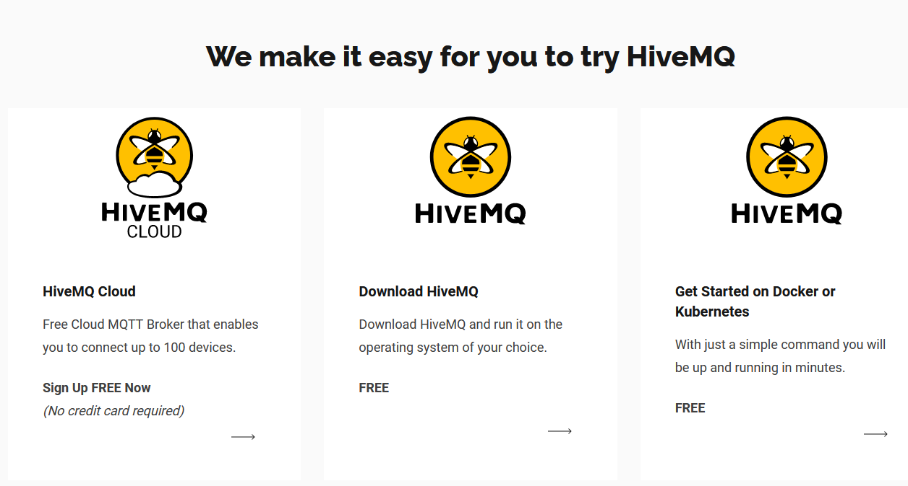
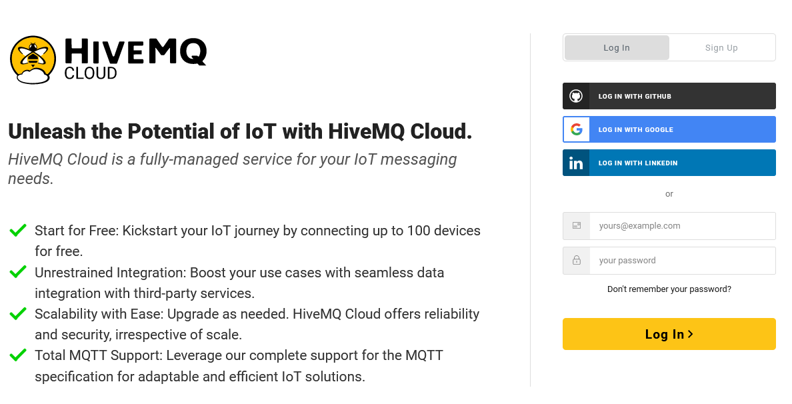
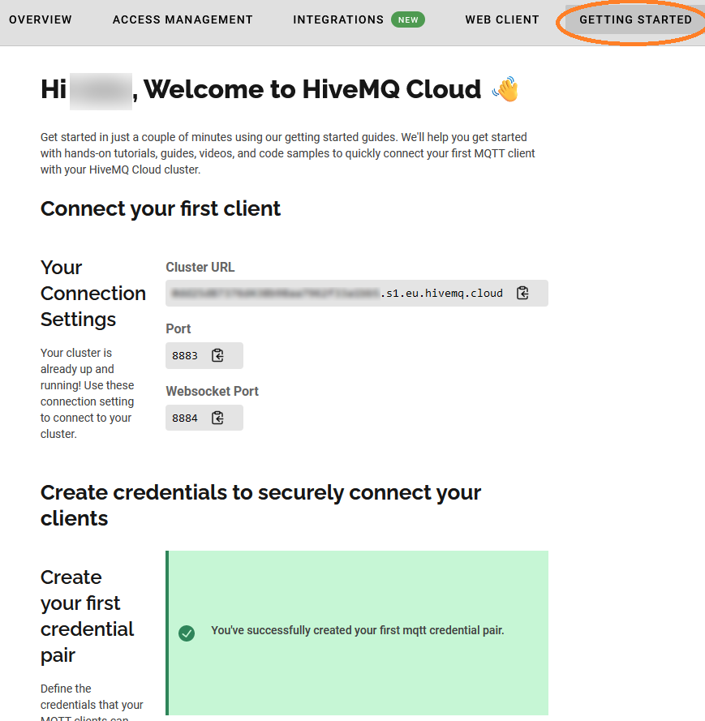
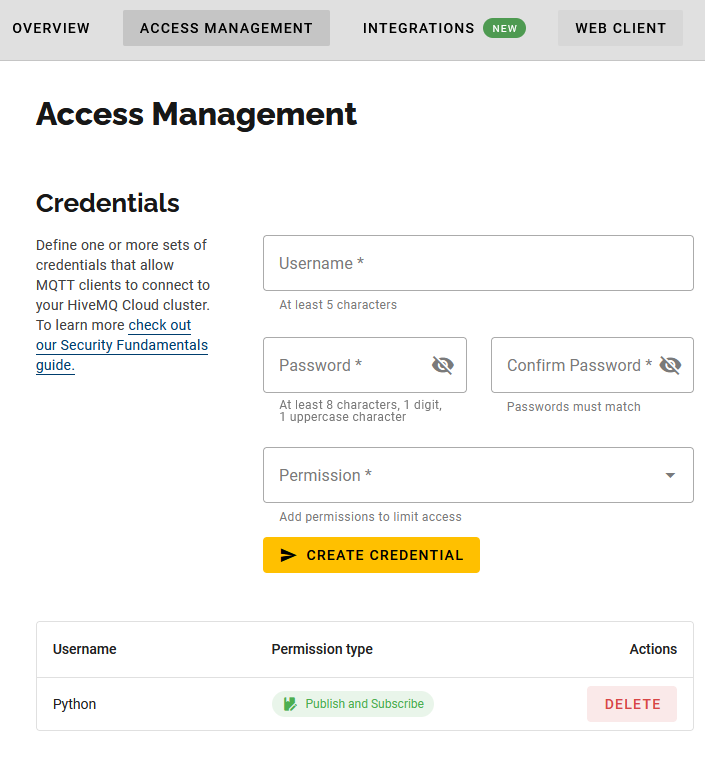
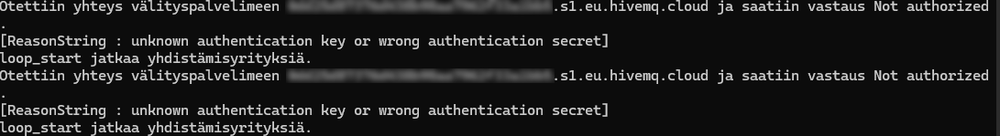

# Lisätietoa

Tässä osiossa käydään läpi viestin mittausdatan käsittely, julkaisu ja tilaaminen ilman asiakasta sekä yhteyden salaaminen käyttämällä käyttäjätunnusta ja salasanaa.

## Viestin mittausdatan käsittely

Edellisen osion esimerkeissä viestin sisältämä informaatio yksinkertaisesti tulostettiin ruudulle, muttei mittausdataa varsinaisesti käsitelty mitenkään. Koska viestin mittausdata on json-muodossa, täytyy myös tilaajan ottaa käyttöön moduuli `json`, jotta mittausdataa voidaan lukea. Eli tiedoston alkuun tulee lisätä rivi

    import json

Tämän jälkeen `on_message`-funktio voidaan muuttaa esim. seuraavanlaiseksi

    def on_message(client, userdata, msg):
        message = msg.payload.decode("utf-8")
        message = json.loads(message)
        print(f"Mitattu paine on {message["pressure"]} Pa.")
        print(F"Mitattu lämpötila on {message["temperature"]} celsiusta.)

Nyt viestin muuttamisen tekstiksi ja sen näytölle tulostamisen sijaan funktio purkaa sanakirjasta lukuarvot paineelle ja lämpötilalle. Näitä voidaan käyttää hyödyksi laskuissa ja ehtolauseissa.

## Julkaisu ja tilaaminen ilman asiakasta

Joskus voi tulla tarve julkaista tai tilata yksittäinen viesti tai yksittäisiä viestejä ja saman tien katkaista yhteys välityspalvelimelle. Tällöin ei tarvitse luoda asiakasta, kuten edellisen osion esimerkkiohjelmissa tehtiin, vaan voi käyttää Paho-MQTT:n moduuleita `publish` ja `subscribe`.

Kaikki esimerkit ovat myös omina tiedostoinaan kansiossa esimerkkiohjelmat.

### Moduuli `publish`

Moduulissa `publish` on yksittäisten viestien julkaisuun funktio `single`. Edellisen osion esimerkkijulkaisija voidaan muuttaa käyttämään tätä funktiota ja julkaisemaan kertaluontoisen viestin seuraavasti:

    import paho.mqtt.publish as publish
    import json
    import random

    BROKER_ADDRESS = "broker.hivemq.com"

    measurement = {
            "pressure": 1024 + random.uniform(-2, 2),
            "temperature": 22 + random.uniform(-3, 3),
            "humidity": 33 + random.uniform(-2, 2) 
        }
    # muunnetaan json-muotoon ja julkaistaan MQTT-välityspalvelimella
    data = json.dumps(measurement)

    try:
        publish.single("tuotantotila/pmxmittaus", 
                data,
                hostname=BROKER_ADDRESS, 
                protocol=MQTTProtocolVersion.MQTTv5)
        print("Viesti julkaistiin onnistuneesti")
    except Exception as e:
        print(f"Viestiä julkaistaessa tapahtui poikkeus: {e}")

Nyt meillä ei ole käytössä callback-funktioita, joten viestin julkaisemisen onnistumista tarkkaillaan poikkeuksia hyödyntämällä `try`&ndash;`except`-rakenteella.

Viestin julkaisu useammasta aiheesta onnistuu nyt &ndash; toisin kuin asiakkaan `publish`-metodia käyttämällä &ndash; yksittäisellä funktiolla `multiple`:

    import paho.mqtt.publish as publish
    from paho.mqtt.enums import MQTTProtocolVersion
    import json
    import random

    BROKER_ADDRESS= "broker.hivemq.com"

    # Paine - lämpötila - kosteus-mittaus
    measurement = {
        "pressure": 1024 + random.uniform(-2, 2),
        "temperature": 22 + random.uniform(-3, 3),
        "humidity": 33 + random.uniform(-2, 2) 
    }

    # Nestemittaukset
    fluid_measurement = {
        "flow_rate": 100 + random.uniform(-5, 5),
        "ph": 8 + random.uniform(-0.5, 0.5)
    }

    # muunna json-muotoon ja lähetä MQTT brokerille
    data1 = json.dumps(measurement)
    data2 = json.dumps(fluid_measurement)

    msgs = [{"topic": "tuotantotila/pmxmittaus", "payload": data1, "qos":0}, {"topic": "tuotantotila/nestemittaus", "payload": data2, "qos": 0}]

    try:
        publish.multiple(msgs, 
                    hostname=BROKER_ADDRESS, 
                    protocol=MQTTProtocolVersion.MQTTv5)
        print("Viestit julkaistiin onnistuneesti")
    except Exception as e:
        print(f"Viestejä julkaistaessa tapahtui poikkeus: {e}")

Viestit voidaan antaa funktiolle `multiple` sekä sanakirjana, kuten ylläolevassa esimerkissä, tai tupleina:

        msgs = [("meas_pmx", s1, 0), ("fluid", s2, 0)]    

### Moduuli `subscribe`

Yksittäisen viestin tilaus tehdään moduulin `subscribe` funktiolla `simple`:

    import paho.mqtt.subscribe as subscribe

    BROKER_ADDRESS = "broker.hivemq.com"

    try:
        msg = subscribe.simple("tuotantotila/pmxmittaus", 
                           hostname=BROKER_ADDRESS,
                           protocol=MQTTProtocolVersion.MQTTv5)
        print(f"viesti vastaanotettu: {msg.payload.decode('utf-8')}")
        print(f"viestin aihe: {msg.topic}")
        print(f"viestin laatutaso: {msg.qos}")
        print(f"viestin säilytyslippu: {msg.retain}")
        print(f"viestin id: {msg.mid}")
    except Exception as e:
        print(f"Tilauksessa tapahtui poikkeus: {e}")

Moduulissa on myös funktio `callback`, jolle voidaan antaa itse määritelty callback-funktio, jonka viestin vastaanotto liipaisee. Alla olevassa esimerkissä callback-funktio tulostaa viestin tiedot ja sisällön kuten edellisen osion callback-funktio `on_message` ja katkaisee yhteyden välityspalvelimelle viiden viestin vastaanoton jälkeen. Esimerkki siis tekee suurin piirtein saman kuin edellisen osion esimerkki asiakkaan `unsubscribe`-metodin käytöstä ja hyödyntää parametria `userdata` viestien määrän laskuun.

    def on_message_print(client, userdata, msg):
        print(f"viesti vastaanotettu: {msg.payload.decode('utf-8')}")
        print(f"viestin aihe: {msg.topic}")
        print(f"viestin laatutaso: {msg.qos}")
        print(f"viestin säilytyslippu: {msg.retain}")
        print(f"viestin id: {msg.mid}")
        userdata.append(msg)
        if len(userdata) >= 5:
            # Katkaistaan yhteys 5 vastaanotetun viestin jälkeen
            print("Riittävä määrä viestejä vastaanotettu.")
            print("Katkaistaan yhteys välityspalvelimeen...")
            client.disconnect()
            print("Yhteys katkaistu.")

    subscribe.callback(on_message_print, 
                   "tuotantotila/pmxmittaus", 
                   hostname=BROKER_ADDRESS, 
                   userdata=[],
                   protocol=MQTTProtocolVersion.MQTTv5)
	

## Käyttäjätunnus ja salasana

Esimerkeissä käytetty välityspalvelin `broker.hivemq.com` on avoin ja sillä julkaistut viestit ovat kaikkien tilattavissa ja luettavissa, jos vain aihe on tiedossa. Pääsyn välityspalvelimelle voi myös rajata käyttäjänimellä ja salasanalla. Käytettäessä HiveMQ:ta, pitää tällöin ensin luoda käyttäjätunnus HiveMQ:hun ja ottaa sieltä henkilökohtainen välityspalvelin käyttöön. 

### HiveMQ Cloudin käyttöönotto ja salasanan asettaminen

HiveMQ Cloud tarjoaa ilmaisia MQTT-palveluita pilvessä ja sinne voi avata oman klusterin (ainakin tätä kirjoitettaessa eli 6.6.2024). Klusteri tarkoittaa useista palvelimista koostuvaa järjestelmää, joka toimii yhtenä kokonaisuutena. Ensin valitaan `www.hivemq.com`ista Get HiveMQ, sitten seuraavaksi aukeavista vaihtoehdoista vasemmanpuoleisin, eli HiveMQ Cloud.

 \
*HiveMQ:n palveluvaihtoehdot*

Seuraavaksi palveluun pitää luoda tunnukset.

Kun tunnukset on luotu, pitää luoda vähintään yksi käyttäjätunnus-salasanapari. MQTT käyttää oletuksena porttia 1883, mutta HiveMQ Cloudissa käytetään salatulle liikenteelle varattua porttia 8883. Klusteriin ei saa otettua yhteyttä ilman, että asetetaan vähintään yksi käyttäjätunnus-salasanapari. Nopeinta tämä on luoda välilehdellä Getting Started, jolloin samalta sivulta saa myös helposti kopioitua klusterin osoitteen. Tämä on Paho MQTT:lle annettava välityspalvelimen osoite.

 \
*Getting Started -valikko*

Getting Started -valikon alalaidasta löytyy ohjeita eri ohjelmointikielten ja laitteiden käytölle HiveMQ Cloudin kanssa. Pythonin ja Pahon ohjeistukseen pääsee klikkaamalla Pythonin logoa. Jos tässä osiossa esitellyt esimerkkiohjelmat eivät jostain syystä toimi, kannattaa tarkistaa, onko sinne tullut muutoksia.

Välilehdellä Access Management voi käyttäjätunnus-salasanapareja voi hallita tarkemmin. Jokaiselle niistä valitaan, annetaanko sillä pääsy julkaisemiseen, tilaamiseen vai molempiin. Alareunassa myös näkyy jo luodut parit. Tässä on luotu käyttäjätunnus *Python* ja salasana *V3n0m0u5*, ja tälle parille on annettu sekä julkaisu- että tilausoikeudet. 

*Tunnusten ja salasanojen hallinta*

Yksinkertaisimmillaan käyttäjätunnus ja salasana asetetaan luodulle asiakkaalle nimeltä `client` selkotekstinä seuraavalla rivillä, joka pitää olla ennen komentoa `client.connect(...)`:

### Käyttäjänimen ja salasanan asettaminen MQTT-asiakkalle Paho MQTT:ssä

Asiakkaalle käyttäjätunnus ja salasana asetetaan käyttämällä funktiota `username_pw_set`. Koska HiveMQ ei tue salaamattomia yhteyksiä, salausprotokolla TLS pitää ottaa käyttöön. Nämä molemmat pitää tehdä ennen yhteydeottoa. Yhteyttä ottaessa pitää lisäksi muistaa käyttää porttia 8883.

    client.tls_set(tls_version=mqtt.ssl.PROTOCOL_TLS)
    client.username_pw_set("Python", "V3n0m0u5")

    client.connect(BROKER_ADDRESS, port=8883)

Nämä asetukset pitää olla molemmilla, sekä julkaisijalla ja tilaajalla. HiveMQ Cloudissahan luotiin yksi käyttäjätunnus-salasanapari, joka sallii sekä julkaisemisen ja tilaamisen. Jos nyt yrittää ottaa yhteyttä klusteriin eli välityspalvelimeen ilman tätä paria, yhteyden muodostaminen ei onnistu kuten seuraava kuva näyttää.

 \
*Epäonnistunut yhteydeotto*

Esimerkit käyttäjätunnus-salasanaparia käyttävästä julkaisijasta ja tilaajasta ovat tiedostoissa *03-julkaisija_salaus.py* ja *03-tilaaja_salaus.py*.

### Käyttäjänimen ja salasanan asettaminen ilman asiakasta

Käytettäessä moduulia `publish` tai `subscribe`, käyttäjätunnus ja salasana asetetaan vastaavasti funktioiden `single`, `multiple`, `simple` ja `callback` parametrilla `auth`: Lisäksi näissä funktiossa täytyy määritellä portiksi 8883 ja lisätä tls-asetukset. Sitä varten täytyy myös importa moduuli ssl komennolla `import ssl`.

    tls_settings = {"tls_version": ssl.PROTOCOL_TLS}

    publish.single("tuotantotila/pmxmittaus", 
                data,
                hostname=BROKER_ADDRESS,
                port=8883,     
                auth={"username": Python "password": V3n0m0u5},
                tls=tls_settings,
                protocol=MQTTProtocolVersion.MQTTv5)

käyttäjätunnus-salasanaparia hyödyntävät esimerkit funktioista `publish.single` ja `subscribe.simple` ovat tiedostoissa *03-publish_single_salaus.py* ja  *03-subscribe_simple_salaus.py*. Funktioit `multiple` ja `callback` toimivat vastaavasti.

## Tehtäviä

1. Muunna edellisen osion tilaaja.py siten, että se ei tulosta jokaista viestiä näytölle, vain ainoastaan varoituksen, kun lämpötila on alle 21 astetta, kun paine on yli 1025 Pa ja kun kosteus on yli 34 ppm. Se myös käyttää hyödykseen parametria `userdata`, jossa se ylläpitää laskureita raja-arvojen ylisten määrälle (esim. muuttujat `count_press`, `count_temp`, `count_hum`)
2. Kokeile esimerkkejä julkaisemisesta ja tilaamisesta ilman asiakasta. Julkaisemisen tapauksessa aja ensin edellisen osion asiakasta hyödyntävä tilaajaohjelma (*02-tilaaja.py*) ja jätä se odottamaan julkaisijaa. Tilaamista kokeillessasi taas hyödynnä julkaisijaohjelmaa *02-julkaisija.py*.
3. Ota HiveMQ Cloud -klusteri käyttöösi ja kokeile käyttäjänimeä ja salasanaa viestinvälityksessä.
4. Tässä käyttäjätunnus ja salasana annettiin selkotekstinä. Ne saa siis tiedostoista urkittua. Selvitä, miten tässä voi hyödyntää hash-algoritmia eli algoritmia, joka muuttaa käyttäjänimen ja salasanan kiinteän pituiseksi sekasotkun näköiseksi merkkijonoksi.
5. Selvitä, mitä ovat MQTT:n ominaisuudet Last Will ja Testament ja toteuta ne Paho MQTT:llä.

## Kurssin rakenne

### [Johdanto](01-johdanto.md) | [Toiminta](02-toiminta.md) | Lisätietoa