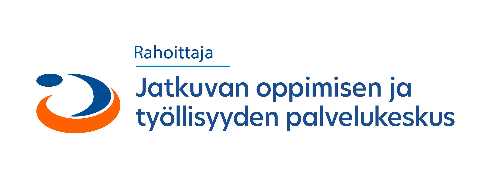

# MQTT:n perusteet Pythonilla

Tämä on Seinäjoen ammattikorkeakoulun toteuttaman ohjelmistosuunnitteluhankkeen aikana luotu oppimismateriaalikokonaisuus MQTT-konenäkökirjastosta. Hankkeen rahoittajana toimi jatkuvan oppimisen ja työllisyyden palvelukeskus Jotpa.

Ala ahmimaan tietoa MQTT:sta sivulta [01-johdanto.md](01-johdanto.md).

